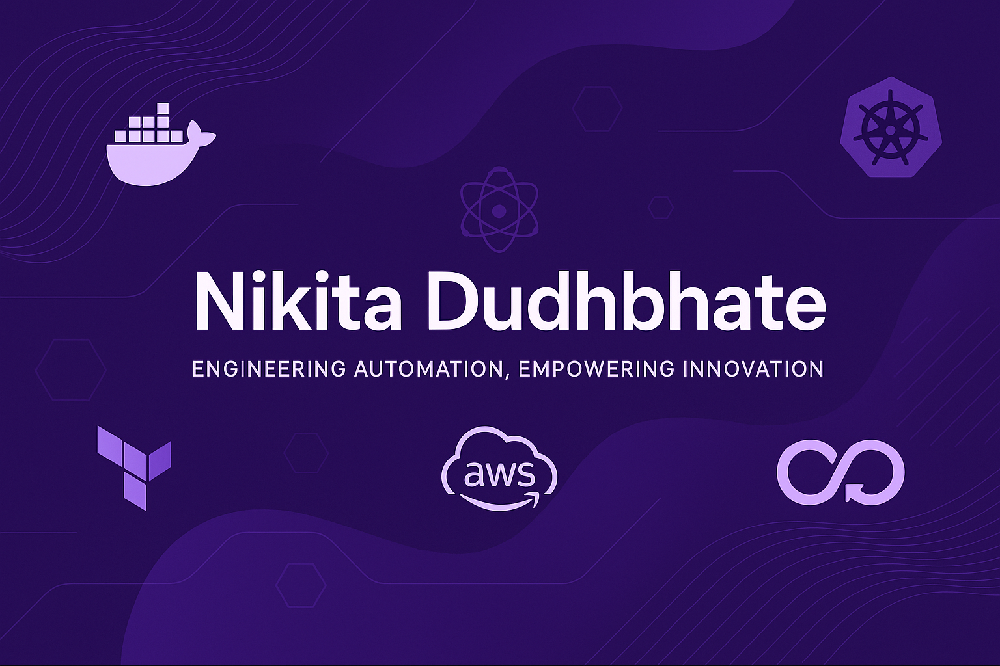

<h1 align="center">👋 Nikita Dudhbhate</h1>
<!--
<h3 align="center">🚀 DevOps Engineer | Cloud Enthusiast | CI/CD Automator</h3>
<marquee behavior="scroll" direction="right" scrollamount="8">
  <h3 align="center">🚀 DevOps Engineer | ☁️ Cloud Enthusiast | 🔁 CI/CD Automator | 🐳 Docker Lover | ⚙️ Infrastructure as Code Fan</h3>
</marquee>
-->

  

  
 

---

  
   
  

---

### 🧠 About Me

🌟 DevOps Engineer with a passion for automating everything!  
🌐 Love building pipelines, deploying on AWS, and writing clean IaC.  
🎯 Focused on sharing knowledge with the DevOps community.

---

## 🚀 Tech Stack & Tools

  
  
  
  
  
  
  
  
  

---

## 🌐 Connect with Me

  
  
  
  
  
  

---

### 🚀 My DevOps Projects

| 🌟 Project | 🛠️ Stack | 🔗 Link |
|-----------|----------|--------|
| **CI/CD Pipeline for Flask App** | Docker, GitHub Actions, EC2 | [View Repo](https://github.com/nikitadudhbhate/flask-cicd-pipeline) |
| **FastAPI on AWS ECS** | Docker, ECR, ECS, Fargate | [View Repo](https://github.com/nikitadudhbhate/ecs-fastapi-deploy) |
| **AWS Lambda as Docker Container** | Lambda, ECR, GitHub Actions | [View Repo](https://github.com/nikitadudhbhate/lambda-docker-deploy) |
| **Static Site to S3** | Flask, Jinja2, S3, Docker | [View Repo](https://github.com/nikitadudhbhate/static-site-s3) |
| **Infra Provisioning Automation** | Docker, CloudFormation, Python (boto3) | [View Repo](https://github.com/nikitadudhbhate/aws-infra-automation) |

---

### 📜 Certifications

---

### ✍️ Blogs & Profiles

- 📝 [Hashnode Blog](https://nikitadudhbhate.hashnode.dev)
- ☁️ [Qwiklabs Profile](https://www.qwiklabs.com/public_profiles/yourprofile)

---

### 📊 GitHub Stats & Activity

  

 

 

---

### 🤝 Let's Collaborate

If you're building a DevOps project, automating deployments, or working with containers — let's connect and build something awesome together!

---

  ⭐️ Star your favorite repos & let’s grow together!

<!--
**nikitadudhbhate/nikitadudhbhate** is a ✨ _special_ ✨ repository because its `README.md` (this file) appears on your GitHub profile.

Here are some ideas to get you started:

- 🔭 I’m currently working on ...
- 🌱 I’m currently learning ...
- 👯 I’m looking to collaborate on ...
- 🤔 I’m looking for help with ...
- 💬 Ask me about ...
- 📫 How to reach me: ...
- 😄 Pronouns: ...
- ⚡ Fun fact: ...
-->
